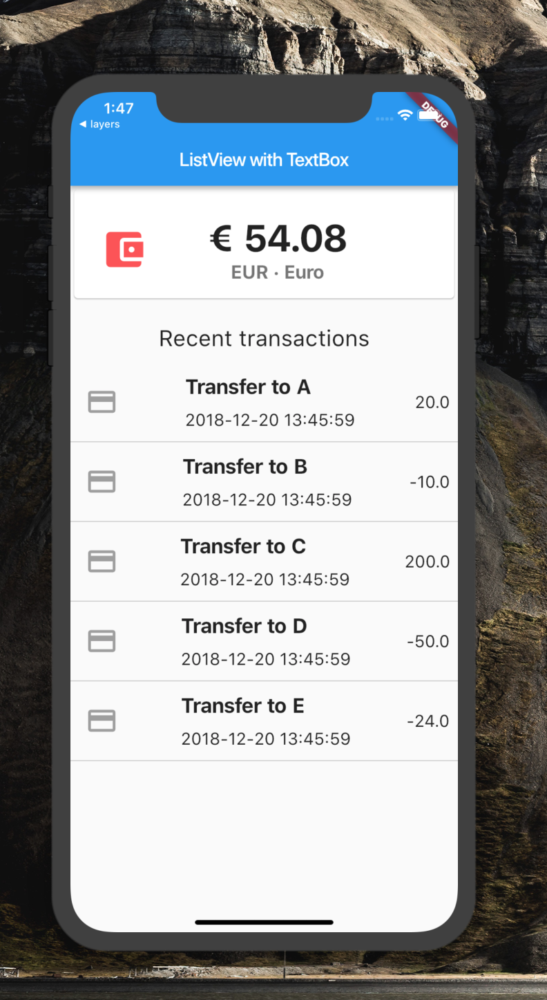

# flutter_listview_with_textfield

A new Flutter project.

# Screenshot

# Code snippet studied from
https://flutter.io/docs/cookbook/lists/mixed-list
https://medium.com/@DakshHub/flutter-displaying-dynamic-contents-using-listview-builder-f2cedb1a19fb

## Getting Started

This project is a starting point for a Flutter application.

A few resources to get you started if this is your first Flutter project:

- [Lab: Write your first Flutter app](https://flutter.io/docs/get-started/codelab)
- [Cookbook: Useful Flutter samples](https://flutter.io/docs/cookbook)

For help getting started with Flutter, view our 
[online documentation](https://flutter.io/docs), which offers tutorials, 
samples, guidance on mobile development, and a full API reference.
